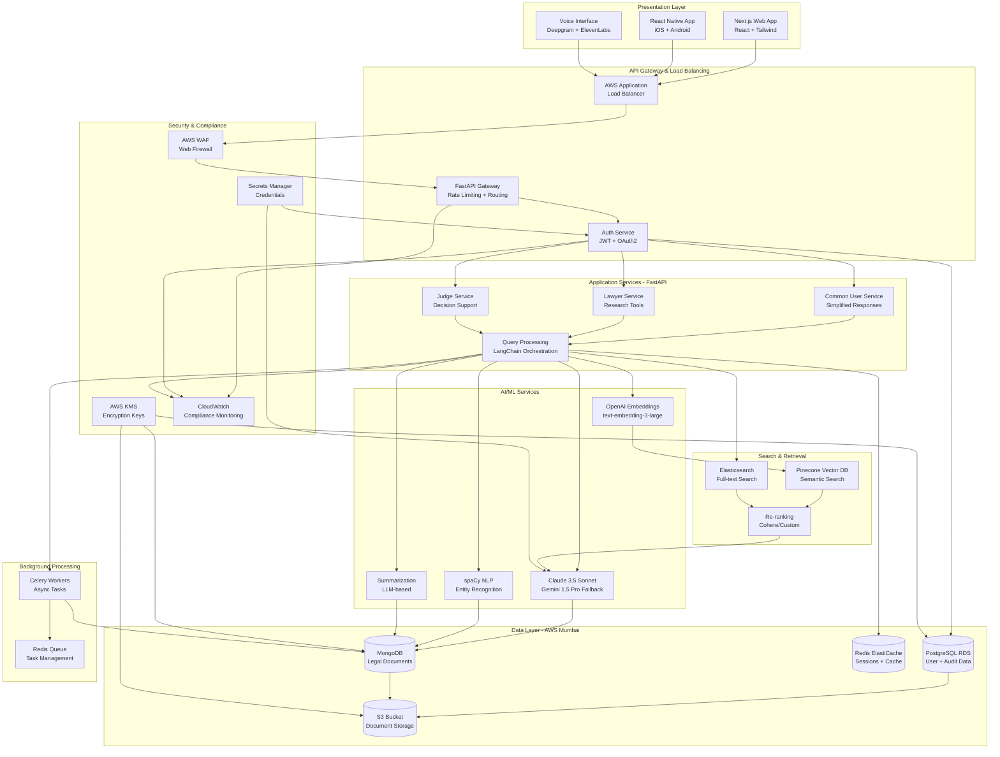
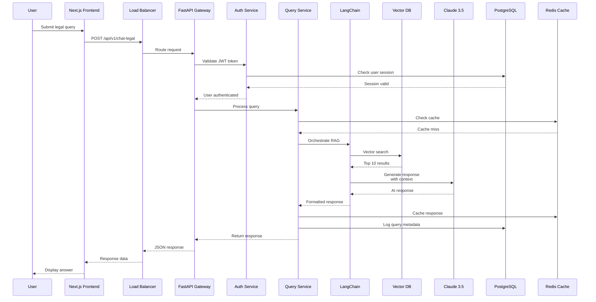

# Design Document: Nyay Sahayak

## Overview

Nyay Sahayak is an AI-powered legal assistant system designed for the Indian judicial ecosystem. The system employs a microservices architecture with role-based access control, natural language processing for multi-lingual query understanding, and a comprehensive legal knowledge base covering Indian statutes, case law, and regulations.

The architecture separates concerns into distinct layers:
- **Presentation Layer**: Multi-platform interfaces (web, mobile, voice)
- **Application Layer**: Role-specific services for Common Users, Lawyers, and Judges
- **AI/ML Layer**: Natural language processing, query understanding, and response generation
- **Data Layer**: Legal knowledge base, user data, and audit logs
- **Security Layer**: Authentication, authorization, encryption, and compliance monitoring

The system is designed to scale horizontally, maintain high availability, and ensure data sovereignty by hosting all components within Indian jurisdiction.

## Technology Stack

### Backend Stack

**API Framework**: Python with FastAPI
- High performance async framework
- Automatic OpenAPI documentation
- Built-in data validation with Pydantic
- Native async/await support for concurrent operations
- Type hints for better code quality

**AI/ML Engine**: 
- **Primary LLM**: Anthropic Claude 3.5 Sonnet
  - Superior reasoning capabilities for legal analysis
  - 200K context window for processing lengthy judgments
  - Strong multi-lingual support for Indian languages
  - Better instruction following for role-specific responses
  
- **Fallback LLM**: Google Gemini 1.5 Pro
  - 1M+ token context window for very large documents
  - Strong performance on Indian legal content
  - Cost-effective for high-volume queries
  
- **RAG Architecture**: Retrieval-Augmented Generation
  - Vector database for semantic search over legal corpus
  - Hybrid search combining dense vectors and keyword matching
  - Re-ranking for improved relevance
  - Citation tracking for source attribution
  - **Long-context handling** for lengthy judgments (see RAG Pre-processing section below)

**Vector Database**: Pinecone
- Managed vector database for production scale
- Fast similarity search (< 100ms for millions of vectors)
- Metadata filtering for court, date, jurisdiction
- Hybrid search support
- High availability and automatic backups

**Metadata Schema for Vector Storage**:
```json
{
  "case_id": "string",
  "case_year": "integer",
  "court_level": "enum[supreme_court, high_court, district_court, tribunal]",
  "court_name": "string",
  "presiding_judge": "string[]",
  "act_reference": "string[]",
  "section_reference": "string[]",
  "jurisdiction": "enum[delhi, maharashtra, gujarat, ...]",
  "case_type": "enum[civil, criminal, constitutional, ...]",
  "legal_topics": "string[]",
  "citation": "string",
  "date_decided": "date",
  "precedential_value": "enum[binding, persuasive, overruled]",
  "chunk_index": "integer",
  "total_chunks": "integer",
  "document_type": "enum[judgment, statute, regulation, commentary]"
}
```

**Alternative Vector DB**: Qdrant (self-hosted option)
- Open-source for data sovereignty
- Deployed in Indian data centers
- Advanced filtering capabilities
- Quantization for reduced storage costs

**Embedding Model**: 
- **Primary**: OpenAI text-embedding-3-large
  - 3072 dimensions for high accuracy
  - Strong performance on legal text
  
- **Alternative**: Cohere embed-multilingual-v3
  - Better support for Indian languages
  - 1024 dimensions for efficiency

**Database**: PostgreSQL 15+
- JSONB support for flexible document storage
- Full-text search capabilities
- Strong ACID guarantees for audit logs
- Mature replication and backup tools

**Document Store**: MongoDB
- Flexible schema for varied legal documents
- GridFS for large judgment PDFs
- Aggregation pipeline for analytics
- Change streams for real-time updates

**Cache**: Redis 7+
- In-memory caching for frequent queries
- Session storage
- Rate limiting
- Pub/sub for real-time features

**Task Queue**: Celery with Redis
- Async processing for summarization
- Scheduled tasks for knowledge base updates
- Distributed task execution
- Retry logic for failed tasks

**Search Engine**: Elasticsearch 8+
- Full-text search across legal corpus
- Faceted search for filtering
- Highlighting for search results
- Synonym support for legal terms

### Frontend Stack

**Framework**: Next.js 14+ (React)
- Server-side rendering for SEO
- API routes for backend integration
- Static generation for public pages
- Image optimization
- Built-in internationalization

**UI Library**: 
- **Component Library**: shadcn/ui (Radix UI + Tailwind)
  - Accessible components (WCAG 2.1 AA)
  - Customizable with Tailwind
  - TypeScript support
  
- **Styling**: Tailwind CSS
  - Utility-first CSS
  - Responsive design
  - Dark mode support
  - Custom design system

**State Management**: 
- React Query (TanStack Query) for server state
- Zustand for client state
- Context API for theme and auth

**Form Handling**: React Hook Form
- Performance-focused
- Built-in validation
- TypeScript support

**Rich Text**: 
- Lexical for document editing
- PDF.js for judgment viewing
- Syntax highlighting for legal citations

**Voice Interface**: 
- Web Speech API for browser-based voice
- Deepgram for high-quality speech-to-text
- ElevenLabs for natural text-to-speech in Indian languages

### AI/ML Pipeline

**Document Processing**:
- PyPDF2 / pdfplumber for PDF extraction
- spaCy for NER (legal entities)
- Custom models for Indian legal entity recognition
- LangChain for LLM orchestration

**Vector Pipeline**:
```
Legal Document → Text Extraction → Chunking (500 tokens, 50 overlap) 
→ Embedding Generation → Vector Storage → Metadata Indexing
```

**RAG Pipeline**:
```
User Query → Query Embedding → Vector Search (top 10) 
→ Re-ranking (top 5) → Context Assembly → LLM Prompt 
→ Response Generation → Citation Extraction → Response Formatting
```

### RAG Pre-processing for Long-Context Documents

Indian legal judgments can be extremely long (50-500 pages). Standard chunking strategies lose context and coherence. We employ a hierarchical indexing strategy:

**Challenge**: Supreme Court judgments average 50-100 pages, with some exceeding 500 pages. Simple chunking loses the logical structure and relationships between sections.

**Solution: Hierarchical Indexing with Sliding Window Chunking**

1. **Document Structure Extraction**:
   ```
   Judgment → Parse Structure → Extract Sections
   - Header (parties, judges, date)
   - Facts
   - Issues
   - Arguments (petitioner/respondent)
   - Analysis
   - Holdings
   - Ratio Decidendi
   - Obiter Dicta
   - Conclusion
   ```

2. **Multi-Level Chunking Strategy**:
   
   **Level 1: Summary Chunk** (Always retrieved first)
   - Case metadata + AI-generated summary
   - Key holdings and principles
   - Size: ~500 tokens
   - Purpose: Quick relevance check
   
   **Level 2: Section Chunks** (Retrieved based on query intent)
   - Each major section as separate chunk
   - Preserves logical boundaries
   - Size: 1000-2000 tokens per section
   - Purpose: Targeted retrieval
   
   **Level 3: Sliding Window Chunks** (For detailed analysis)
   - Overlapping chunks within sections
   - Window size: 500 tokens
   - Overlap: 100 tokens (20%)
   - Purpose: Detailed context without losing continuity

3. **Hierarchical Retrieval Process**:
   ```
   Query → Retrieve Level 1 (top 20 cases)
   → Filter by relevance (top 10 cases)
   → Retrieve Level 2 sections (top 5 cases)
   → If needed, retrieve Level 3 chunks for specific sections
   → Assemble context maintaining document structure
   ```

4. **Context Assembly**:
   - Start with summary chunk
   - Add relevant section chunks
   - Add sliding window chunks for specific details
   - Maintain hierarchical structure in prompt
   - Total context: ~8000 tokens (fits in Claude's context window with room for response)

5. **Citation Tracking**:
   - Each chunk maintains reference to source document
   - Section and page numbers preserved
   - Enables precise citation in responses

**Example Chunking for a 100-page Judgment**:
```
- 1 Summary chunk (500 tokens)
- 8 Section chunks (1500 tokens each = 12,000 tokens)
- 200 Sliding window chunks (500 tokens each = 100,000 tokens)
Total: ~112,500 tokens stored
Retrieved per query: ~8,000 tokens (summary + 5 sections + 10 windows)
```

**Benefits**:
- Preserves document structure and logical flow
- Enables targeted retrieval based on query intent
- Handles very long documents without losing context
- Maintains citation accuracy
- Reduces LLM context usage while improving relevance

### PII Masking for Sensitive Cases

Legal cases often contain sensitive personal information, especially in family law, criminal law, and civil disputes. We implement automatic PII detection and masking before LLM processing.

**Challenge**: Judges and lawyers work with sensitive cases containing names, addresses, financial details, and other PII that should not be exposed to external LLMs or logged.

**Solution: Multi-Layer PII Detection and Masking**

1. **PII Categories Detected**:
   - Personal names (parties, witnesses, victims)
   - Addresses (residential, business)
   - Phone numbers and email addresses
   - Financial information (account numbers, amounts in certain contexts)
   - Medical information
   - Aadhaar numbers, PAN numbers, passport numbers
   - Vehicle registration numbers
   - Minor's information (always masked)

2. **Detection Pipeline**:
   ```
   Document → spaCy NER → Custom Legal NER Model
   → Pattern Matching (regex for IDs, numbers)
   → Contextual Analysis → PII Entities Identified
   ```

3. **Masking Strategy**:
   
   **For Common Users**:
   - Full masking of all PII
   - Replace with generic placeholders
   - Example: "Ramesh Kumar" → "[PERSON_1]"
   - Example: "123 MG Road, Delhi" → "[ADDRESS_1]"
   
   **For Lawyers/Judges** (configurable):
   - Partial masking (preserve case context)
   - Example: "Ramesh Kumar" → "R. K."
   - Example: "Aadhaar: 1234 5678 9012" → "Aadhaar: ****-****-9012"
   - Option to disable masking for authorized users
   
   **For Sensitive Case Types** (always masked):
   - Family law: All party names, addresses
   - Sexual offenses: Victim identity always masked
   - Juvenile cases: Minor's identity always masked
   - Medical negligence: Patient details masked

4. **Masking Implementation**:
   ```python
   def mask_pii(text: str, user_role: UserRole, case_type: CaseType) -> MaskedDocument:
       # Detect PII entities
       entities = detect_pii(text)
       
       # Determine masking level
       masking_level = get_masking_level(user_role, case_type)
       
       # Apply masking
       masked_text = apply_masking(text, entities, masking_level)
       
       # Store mapping for potential de-masking (encrypted)
       masking_map = create_masking_map(entities)
       
       return MaskedDocument(
           masked_text=masked_text,
           masking_map=encrypt(masking_map),
           entities_masked=len(entities)
       )
   ```

5. **Reversible Masking** (for authorized users):
   - Masking map stored encrypted with user-specific key
   - Only authorized users can de-mask
   - Audit log records all de-masking operations
   - Time-limited de-masking tokens

6. **LLM Processing**:
   ```
   Original Document → PII Detection → Masking
   → Send to LLM → Generate Response
   → Re-insert PII (if authorized) → Return to User
   ```

7. **Audit and Compliance**:
   - All PII detection logged (without storing PII)
   - Masking operations audited
   - De-masking operations require justification
   - Compliance with Digital Personal Data Protection Act 2023

**Example Masking**:

Original:
```
"In the matter of Ramesh Kumar v. State of Delhi, the petitioner residing at 
123 MG Road, Delhi-110001, Aadhaar No. 1234-5678-9012, has filed a petition..."
```

Masked (Common User):
```
"In the matter of [PERSON_1] v. State of Delhi, the petitioner residing at 
[ADDRESS_1], Aadhaar No. [ID_1], has filed a petition..."
```

Masked (Lawyer/Judge - Partial):
```
"In the matter of R. K. v. State of Delhi, the petitioner residing at 
[ADDRESS_1], Aadhaar No. ****-****-9012, has filed a petition..."
```

**Benefits**:
- Protects sensitive personal information
- Complies with data protection regulations
- Maintains case context for legal professionals
- Prevents PII exposure to external LLMs
- Auditable and reversible for authorized users
- Automatic detection reduces manual effort

**Prompt Engineering**:
- Role-specific system prompts
- Few-shot examples for legal reasoning
- Chain-of-thought for complex analysis
- Constitutional constraints for Indian law

### Infrastructure

**Cloud Provider**: AWS (Mumbai Region - ap-south-1)
- Data residency compliance
- Low latency for Indian users
- Comprehensive service offerings

**Container Orchestration**: 
- Docker for containerization
- Amazon ECS Fargate for serverless containers
- Alternative: Kubernetes (EKS) for more control

**CI/CD**: 
- GitHub Actions for automation
- Docker Hub for image registry
- Automated testing and deployment
- Blue-green deployments

**Monitoring**: 
- CloudWatch for AWS metrics
- Sentry for error tracking
- Prometheus + Grafana for custom metrics
- OpenTelemetry for distributed tracing

**Security**:
- AWS WAF for web application firewall
- AWS KMS for encryption key management
- AWS Secrets Manager for credentials
- AWS GuardDuty for threat detection

## Architecture

### High-Level Architecture



### Detailed System Architecture



### Component Interaction Flow

1. **User Request Flow**:
   - User submits query through presentation layer
   - API Gateway routes to Authentication Service
   - Authentication Service validates credentials and determines User_Role
   - Request forwarded to appropriate role-specific service
   - Role service invokes Query Processing Service
   - Query Processing coordinates with AI/ML services
   - Response generated and returned through the chain

2. **Data Flow**:
   - All sensitive data encrypted at rest and in transit
   - Personal identifiers anonymized before logging
   - Audit logs written for all operations
   - Cache layer reduces database load for frequent queries

## Components and Interfaces

### 1. Authentication Service

**Responsibilities**:
- User credential validation
- Role assignment and verification
- Session management
- Token generation and validation

**Interface**:
```typescript
interface AuthenticationService {
  // Authenticate user and return session token
  authenticate(credentials: UserCredentials): Promise<AuthToken>
  
  // Validate existing session token
  validateToken(token: string): Promise<TokenValidation>
  
  // Assign role based on verified credentials
  assignRole(userId: string, credentials: VerifiedCredentials): Promise<UserRole>
  
  // Terminate user session
  logout(token: string): Promise<void>
  
  // Refresh expiring token
  refreshToken(token: string): Promise<AuthToken>
}

interface UserCredentials {
  username: string
  password: string
  mfaCode?: string
}

interface AuthToken {
  token: string
  expiresAt: Date
  userId: string
  role: UserRole
}

interface TokenValidation {
  valid: boolean
  userId?: string
  role?: UserRole
  expiresAt?: Date
}

enum UserRole {
  COMMON_USER = "common_user",
  LAWYER = "lawyer",
  JUDGE = "judge"
}
```

### 2. Query Processing Service

**Responsibilities**:
- Query intake and validation
- Language detection
- Query routing to appropriate AI services
- Response aggregation and formatting
- Caching frequent queries

**Interface**:
```typescript
interface QueryProcessingService {
  // Process user query and return response
  processQuery(query: LegalQuery): Promise<QueryResponse>
  
  // Detect language of query
  detectLanguage(text: string): Promise<Language>
  
  // Validate query format and content
  validateQuery(query: LegalQuery): Promise<ValidationResult>
  
  // Route query to appropriate AI service
  routeQuery(query: LegalQuery): Promise<AIServiceType>
}

interface LegalQuery {
  queryId: string
  userId: string
  userRole: UserRole
  text: string
  language?: Language
  context?: QueryContext
  timestamp: Date
}

interface QueryResponse {
  queryId: string
  response: string
  sources: Source[]
  confidence: number
  language: Language
  disclaimers: string[]
  timestamp: Date
}

interface QueryContext {
  previousQueries?: string[]
  sessionId?: string
  jurisdiction?: string
}

enum Language {
  ENGLISH = "en",
  HINDI = "hi",
  TAMIL = "ta",
  TELUGU = "te",
  BENGALI = "bn",
  MARATHI = "mr",
  GUJARATI = "gu",
  KANNADA = "kn",
  MALAYALAM = "ml",
  PUNJABI = "pa",
  ODIA = "or",
  ASSAMESE = "as"
}
```

### 3. NLP Engine

**Responsibilities**:
- Multi-lingual text processing
- Named entity recognition (legal entities, statutes, cases)
- Intent classification
- Query expansion and reformulation

**Interface**:
```typescript
interface NLPEngine {
  // Extract legal entities from text
  extractEntities(text: string, language: Language): Promise<LegalEntity[]>
  
  // Classify user intent
  classifyIntent(query: string, language: Language): Promise<Intent>
  
  // Translate query to English for processing
  translateToEnglish(text: string, sourceLanguage: Language): Promise<string>
  
  // Translate response back to user's language
  translateFromEnglish(text: string, targetLanguage: Language): Promise<string>
  
  // Expand query with synonyms and related terms
  expandQuery(query: string): Promise<string[]>
}

interface LegalEntity {
  text: string
  type: EntityType
  startOffset: number
  endOffset: number
  confidence: number
}

enum EntityType {
  STATUTE = "statute",
  CASE_NAME = "case_name",
  COURT = "court",
  LEGAL_CONCEPT = "legal_concept",
  DATE = "date",
  PERSON = "person"
}

interface Intent {
  primaryIntent: IntentType
  confidence: number
  subIntents: IntentType[]
}

enum IntentType {
  EXPLAIN_LAW = "explain_law",
  SEARCH_CASE = "search_case",
  FIND_STATUTE = "find_statute",
  SUMMARIZE_DOCUMENT = "summarize_document",
  COMPARE_CASES = "compare_cases",
  FIND_PRECEDENT = "find_precedent",
  EXPLAIN_RIGHTS = "explain_rights",
  EXPLAIN_PROCEDURE = "explain_procedure"
}
```

### 4. Question Answering Service

**Responsibilities**:
- Answer legal questions using knowledge base
- Generate explanations appropriate to user role
- Provide source citations
- Handle multi-turn conversations

**Interface**:
```typescript
interface QuestionAnsweringService {
  // Answer legal question
  answerQuestion(query: LegalQuery, context: QueryContext): Promise<Answer>
  
  // Generate role-appropriate explanation
  generateExplanation(
    topic: string,
    userRole: UserRole,
    language: Language
  ): Promise<Explanation>
  
  // Find relevant sources for answer
  findSources(query: string): Promise<Source[]>
}

interface Answer {
  text: string
  confidence: number
  sources: Source[]
  relatedQuestions: string[]
  disclaimers: string[]
}

interface Explanation {
  summary: string
  details: string[]
  examples: string[]
  sources: Source[]
  complexity: ComplexityLevel
}

enum ComplexityLevel {
  SIMPLE = "simple",        // For common users
  INTERMEDIATE = "intermediate",  // For lawyers
  ADVANCED = "advanced"     // For judges
}

interface Source {
  type: SourceType
  title: string
  citation: string
  url?: string
  relevance: number
  excerpt?: string
}

enum SourceType {
  STATUTE = "statute",
  CASE_LAW = "case_law",
  REGULATION = "regulation",
  LEGAL_COMMENTARY = "legal_commentary"
}
```

### 5. Case Search Service

**Responsibilities**:
- Search case law database
- Filter and rank results
- Provide case metadata
- Track case status (overruled, affirmed, etc.)

**Interface**:
```typescript
interface CaseSearchService {
  // Search cases with filters
  searchCases(searchParams: CaseSearchParams): Promise<CaseSearchResults>
  
  // Get full case details
  getCaseDetails(caseId: string): Promise<CaseDetails>
  
  // Find cases citing a specific case
  findCitingCases(caseId: string): Promise<Case[]>
  
  // Check if case is still good law
  getCaseStatus(caseId: string): Promise<CaseStatus>
}

interface CaseSearchParams {
  query: string
  courts?: Court[]
  dateRange?: DateRange
  judges?: string[]
  statutes?: string[]
  keywords?: string[]
  limit?: number
  offset?: number
}

interface CaseSearchResults {
  cases: Case[]
  totalCount: number
  facets: SearchFacets
}

interface Case {
  caseId: string
  title: string
  citation: string
  court: Court
  date: Date
  judges: string[]
  summary: string
  keyPrinciples: string[]
  status: CaseStatus
}

interface CaseDetails extends Case {
  fullText: string
  facts: string
  issues: string[]
  holdings: string[]
  reasoning: string
  citedCases: CaseReference[]
  citedStatutes: StatuteReference[]
}

enum Court {
  SUPREME_COURT = "supreme_court",
  HIGH_COURT_DELHI = "high_court_delhi",
  HIGH_COURT_BOMBAY = "high_court_bombay",
  HIGH_COURT_MADRAS = "high_court_madras",
  HIGH_COURT_CALCUTTA = "high_court_calcutta",
  // ... other high courts
  TRIBUNAL = "tribunal"
}

enum CaseStatus {
  GOOD_LAW = "good_law",
  OVERRULED = "overruled",
  DISTINGUISHED = "distinguished",
  AFFIRMED = "affirmed",
  MODIFIED = "modified"
}

interface CaseReference {
  caseId: string
  citation: string
  relationship: CitationRelationship
}

enum CitationRelationship {
  FOLLOWED = "followed",
  DISTINGUISHED = "distinguished",
  OVERRULED = "overruled",
  REFERRED = "referred",
  APPLIED = "applied"
}
```

### 6. Summarization Engine

**Responsibilities**:
- Generate case summaries
- Extract key legal principles
- Create comparative summaries
- Maintain summary quality

**Interface**:
```typescript
interface SummarizationEngine {
  // Summarize a judgment
  summarizeJudgment(caseId: string, options: SummaryOptions): Promise<Summary>
  
  // Generate comparative summary of multiple cases
  compareCases(caseIds: string[]): Promise<ComparativeSummary>
  
  // Extract key principles from judgment
  extractPrinciples(caseId: string): Promise<LegalPrinciple[]>
  
  // Generate decision-support summary for judges
  generateDecisionSupport(caseId: string): Promise<DecisionSupportSummary>
}

interface SummaryOptions {
  maxLength?: number
  includeReasoning?: boolean
  includeFacts?: boolean
  targetRole?: UserRole
}

interface Summary {
  caseId: string
  facts: string
  issues: string[]
  holdings: string[]
  reasoning: string
  keyPrinciples: LegalPrinciple[]
  compressionRatio: number
  generatedAt: Date
}

interface ComparativeSummary {
  cases: Case[]
  commonIssues: string[]
  differingHoldings: HoldingComparison[]
  judicialTrends: string[]
}

interface HoldingComparison {
  issue: string
  holdings: Map<string, string>  // caseId -> holding
  prevailingView?: string
}

interface LegalPrinciple {
  principle: string
  context: string
  importance: PrincipleImportance
}

enum PrincipleImportance {
  RATIO_DECIDENDI = "ratio_decidendi",
  OBITER_DICTUM = "obiter_dictum",
  SUPPORTING = "supporting"
}

interface DecisionSupportSummary {
  caseFacts: string
  legalIssues: string[]
  partiesArguments: PartyArguments
  applicableLaw: ApplicableLaw
  relevantPrecedents: Case[]
  neutralAnalysis: string
}

interface PartyArguments {
  petitioner: string[]
  respondent: string[]
}

interface ApplicableLaw {
  statutes: StatuteReference[]
  precedents: CaseReference[]
  principles: LegalPrinciple[]
}
```

### 7. Legal Knowledge Base

**Responsibilities**:
- Store and index legal documents
- Maintain document versions and amendments
- Track document relationships
- Provide fast retrieval

**Interface**:
```typescript
interface LegalKnowledgeBase {
  // Search statutes
  searchStatutes(query: string, filters: StatuteFilters): Promise<Statute[]>
  
  // Get statute by identifier
  getStatute(statuteId: string, version?: string): Promise<Statute>
  
  // Get statute amendment history
  getAmendmentHistory(statuteId: string): Promise<Amendment[]>
  
  // Index new legal document
  indexDocument(document: LegalDocument): Promise<void>
  
  // Update document status
  updateDocumentStatus(documentId: string, status: DocumentStatus): Promise<void>
}

interface Statute {
  statuteId: string
  title: string
  shortTitle: string
  enactmentDate: Date
  sections: Section[]
  amendments: Amendment[]
  currentVersion: string
}

interface Section {
  sectionNumber: string
  title: string
  text: string
  subsections: Subsection[]
  effectiveDate: Date
  amendments: Amendment[]
}

interface Amendment {
  amendmentId: string
  date: Date
  description: string
  amendedSections: string[]
  amendingAct: string
}

interface StatuteReference {
  statuteId: string
  title: string
  sections: string[]
  citation: string
}

enum DocumentStatus {
  ACTIVE = "active",
  REPEALED = "repealed",
  SUPERSEDED = "superseded",
  PENDING = "pending"
}
```

### 8. Audit and Compliance Service

**Responsibilities**:
- Log all system activities
- Ensure tamper-proof logging
- Monitor compliance violations
- Generate compliance reports

**Interface**:
```typescript
interface AuditService {
  // Log user action
  logAction(action: AuditAction): Promise<void>
  
  // Log query without storing content
  logQuery(queryMetadata: QueryMetadata): Promise<void>
  
  // Retrieve audit logs with filters
  getAuditLogs(filters: AuditFilters): Promise<AuditLog[]>
  
  // Verify log integrity
  verifyLogIntegrity(logId: string): Promise<boolean>
  
  // Generate compliance report
  generateComplianceReport(period: DateRange): Promise<ComplianceReport>
}

interface AuditAction {
  userId: string
  userRole: UserRole
  actionType: ActionType
  resourceId?: string
  timestamp: Date
  ipAddress: string
  success: boolean
  metadata?: Record<string, any>
}

enum ActionType {
  LOGIN = "login",
  LOGOUT = "logout",
  QUERY = "query",
  SEARCH = "search",
  EXPORT = "export",
  VIEW_CASE = "view_case",
  VIEW_STATUTE = "view_statute",
  GENERATE_SUMMARY = "generate_summary"
}

interface QueryMetadata {
  queryId: string
  userId: string
  userRole: UserRole
  queryType: IntentType
  language: Language
  timestamp: Date
  responseTime: number
}

interface AuditLog {
  logId: string
  action: AuditAction
  hash: string
  previousHash: string
}

interface ComplianceReport {
  period: DateRange
  totalActions: number
  actionsByType: Map<ActionType, number>
  actionsByRole: Map<UserRole, number>
  violations: ComplianceViolation[]
  dataRetentionStatus: DataRetentionStatus
}

interface ComplianceViolation {
  violationType: string
  timestamp: Date
  description: string
  severity: ViolationSeverity
}

enum ViolationSeverity {
  LOW = "low",
  MEDIUM = "medium",
  HIGH = "high",
  CRITICAL = "critical"
}
```

### 9. Encryption and Anonymization Service

**Responsibilities**:
- Encrypt sensitive data
- Anonymize personal identifiers
- Manage encryption keys
- Ensure data privacy compliance

**Interface**:
```typescript
interface EncryptionService {
  // Encrypt data
  encrypt(data: string, keyId: string): Promise<EncryptedData>
  
  // Decrypt data
  decrypt(encryptedData: EncryptedData, keyId: string): Promise<string>
  
  // Anonymize personal identifiers
  anonymize(data: string): Promise<AnonymizedData>
  
  // Hash data for integrity verification
  hash(data: string): Promise<string>
}

interface EncryptedData {
  ciphertext: string
  iv: string
  algorithm: string
  keyId: string
}

interface AnonymizedData {
  anonymizedText: string
  anonymizationMap: Map<string, string>  // For potential de-anonymization if authorized
}
```

## API Endpoints

### Authentication Endpoints

**POST /api/v1/auth/register**
- Register new user account
- Request body: `{ username, email, password, role, verificationDocuments }`
- Response: `{ userId, status: "pending_verification" }`

**POST /api/v1/auth/login**
- Authenticate user and create session
- Request body: `{ username, password, mfaCode? }`
- Response: `{ token, refreshToken, userId, role, expiresAt }`

**POST /api/v1/auth/logout**
- Terminate user session
- Headers: `Authorization: Bearer <token>`
- Response: `{ success: true }`

**POST /api/v1/auth/refresh**
- Refresh expired access token
- Request body: `{ refreshToken }`
- Response: `{ token, expiresAt }`

**GET /api/v1/auth/verify**
- Verify token validity
- Headers: `Authorization: Bearer <token>`
- Response: `{ valid: true, userId, role }`

### Legal Query Endpoints

**POST /api/v1/chat-legal**
- Submit legal query and get AI response
- Headers: `Authorization: Bearer <token>`
- Request body:
```json
{
  "query": "What are my rights as a tenant in Delhi?",
  "language": "en",
  "context": {
    "previousQueries": ["query-id-1", "query-id-2"],
    "sessionId": "session-123"
  }
}
```
- Response:
```json
{
  "queryId": "query-456",
  "response": "As a tenant in Delhi, you have the following rights...",
  "sources": [
    {
      "type": "statute",
      "title": "Delhi Rent Control Act, 1958",
      "citation": "Section 14",
      "url": "/statutes/delhi-rent-control-act-1958#section-14",
      "relevance": 0.95
    }
  ],
  "confidence": 0.92,
  "language": "en",
  "disclaimers": ["This information is educational and not legal advice..."],
  "relatedQuestions": [
    "What is the eviction process in Delhi?",
    "How much notice is required for rent increase?"
  ],
  "timestamp": "2024-01-15T10:30:00Z"
}
```

**POST /api/v1/chat-legal/stream**
- Stream legal query response (SSE)
- Same request format as /chat-legal
- Response: Server-Sent Events stream with incremental response

**POST /api/v1/chat-legal/feedback**
- Submit feedback on query response
- Request body:
```json
{
  "queryId": "query-456",
  "rating": 4,
  "comment": "Very helpful explanation",
  "reportedIssue": null
}
```
- Response: `{ success: true }`

### Case Search Endpoints

**GET /api/v1/cases/search**
- Search case law database
- Headers: `Authorization: Bearer <token>` (Lawyer/Judge only)
- Query parameters:
  - `q`: Search query
  - `courts`: Comma-separated court types
  - `dateFrom`: Start date (YYYY-MM-DD)
  - `dateTo`: End date (YYYY-MM-DD)
  - `judges`: Comma-separated judge names
  - `statutes`: Comma-separated statute references
  - `limit`: Results per page (default: 20)
  - `offset`: Pagination offset
- Response:
```json
{
  "cases": [
    {
      "caseId": "case-789",
      "title": "Kesavananda Bharati v. State of Kerala",
      "citation": "AIR 1973 SC 1461",
      "court": "supreme_court",
      "date": "1973-04-24",
      "judges": ["S.M. Sikri", "J.M. Shelat", "..."],
      "summary": "Landmark case establishing the basic structure doctrine...",
      "keyPrinciples": ["Basic structure doctrine", "Judicial review"],
      "status": "good_law"
    }
  ],
  "totalCount": 156,
  "facets": {
    "courts": { "supreme_court": 45, "high_court_delhi": 32 },
    "years": { "2023": 12, "2022": 28 }
  }
}
```

**GET /api/v1/cases/:caseId**
- Get full case details
- Headers: `Authorization: Bearer <token>` (Lawyer/Judge only)
- Response:
```json
{
  "caseId": "case-789",
  "title": "Kesavananda Bharati v. State of Kerala",
  "citation": "AIR 1973 SC 1461",
  "court": "supreme_court",
  "date": "1973-04-24",
  "judges": ["S.M. Sikri", "J.M. Shelat"],
  "fullText": "Full judgment text...",
  "facts": "The petitioner challenged...",
  "issues": ["Whether Parliament can amend fundamental rights"],
  "holdings": ["Parliament cannot alter the basic structure"],
  "reasoning": "The Constitution has certain basic features...",
  "citedCases": [
    {
      "caseId": "case-123",
      "citation": "Golaknath v. State of Punjab",
      "relationship": "overruled"
    }
  ],
  "citedStatutes": [
    {
      "statuteId": "constitution-of-india",
      "sections": ["Article 368"],
      "citation": "Constitution of India, Article 368"
    }
  ],
  "status": "good_law"
}
```

**GET /api/v1/cases/:caseId/citing**
- Get cases that cite this case
- Headers: `Authorization: Bearer <token>` (Lawyer/Judge only)
- Response: Array of case references

**GET /api/v1/cases/:caseId/status**
- Get current legal status of case
- Headers: `Authorization: Bearer <token>` (Lawyer/Judge only)
- Response:
```json
{
  "caseId": "case-789",
  "status": "good_law",
  "statusHistory": [
    {
      "date": "1973-04-24",
      "status": "decided",
      "description": "Original judgment"
    }
  ],
  "overrulingCases": [],
  "followingCases": ["case-101", "case-102"]
}
```

### Case Summary Endpoints

**POST /api/v1/case-summary**
- Generate case summary
- Headers: `Authorization: Bearer <token>` (Lawyer/Judge only)
- Request body:
```json
{
  "caseId": "case-789",
  "options": {
    "maxLength": 500,
    "includeReasoning": true,
    "includeFacts": true,
    "targetRole": "lawyer"
  }
}
```
- Response:
```json
{
  "caseId": "case-789",
  "summary": {
    "facts": "The petitioner, head of a Hindu monastery...",
    "issues": ["Whether Parliament can amend fundamental rights"],
    "holdings": ["Parliament cannot alter the basic structure of the Constitution"],
    "reasoning": "The Constitution has certain basic features that form its foundation...",
    "keyPrinciples": [
      {
        "principle": "Basic structure doctrine",
        "context": "Limits on parliamentary amendment power",
        "importance": "ratio_decidendi"
      }
    ]
  },
  "compressionRatio": 0.15,
  "generatedAt": "2024-01-15T10:35:00Z"
}
```

**POST /api/v1/case-summary/compare**
- Generate comparative summary of multiple cases
- Headers: `Authorization: Bearer <token>` (Lawyer/Judge only)
- Request body:
```json
{
  "caseIds": ["case-789", "case-790", "case-791"]
}
```
- Response:
```json
{
  "cases": [...],
  "commonIssues": ["Scope of fundamental rights"],
  "differingHoldings": [
    {
      "issue": "Can Parliament amend fundamental rights?",
      "holdings": {
        "case-789": "Yes, but not the basic structure",
        "case-790": "No restrictions on amendment power"
      },
      "prevailingView": "Basic structure doctrine (case-789)"
    }
  ],
  "judicialTrends": ["Increasing protection of fundamental rights"]
}
```

**POST /api/v1/decision-support**
- Generate decision-support summary for judges
- Headers: `Authorization: Bearer <token>` (Judge only)
- Request body:
```json
{
  "caseId": "pending-case-123"
}
```
- Response:
```json
{
  "caseFacts": "The petitioner seeks...",
  "legalIssues": ["Issue 1", "Issue 2"],
  "partiesArguments": {
    "petitioner": ["Argument 1", "Argument 2"],
    "respondent": ["Counter-argument 1", "Counter-argument 2"]
  },
  "applicableLaw": {
    "statutes": [...],
    "precedents": [...],
    "principles": [...]
  },
  "relevantPrecedents": [...],
  "neutralAnalysis": "The key legal question is..."
}
```

### Statute Search Endpoints

**GET /api/v1/statutes/search**
- Search statutory provisions
- Headers: `Authorization: Bearer <token>`
- Query parameters: `q`, `limit`, `offset`
- Response:
```json
{
  "statutes": [
    {
      "statuteId": "ipc-1860",
      "title": "Indian Penal Code, 1860",
      "shortTitle": "IPC",
      "sections": [
        {
          "sectionNumber": "302",
          "title": "Punishment for murder",
          "text": "Whoever commits murder shall be punished...",
          "effectiveDate": "1860-01-01"
        }
      ]
    }
  ],
  "totalCount": 45
}
```

**GET /api/v1/statutes/:statuteId**
- Get full statute details
- Headers: `Authorization: Bearer <token>`
- Response: Complete statute with all sections and amendments

**GET /api/v1/statutes/:statuteId/amendments**
- Get amendment history
- Headers: `Authorization: Bearer <token>`
- Response: Array of amendments with dates and descriptions

### Lawyer Dashboard Endpoints

**GET /api/v1/lawyer-dashboard**
- Get lawyer dashboard overview
- Headers: `Authorization: Bearer <token>` (Lawyer only)
- Response:
```json
{
  "recentQueries": [...],
  "savedResearch": [...],
  "recentCases": [...],
  "statistics": {
    "totalQueries": 156,
    "totalResearch": 23,
    "thisWeekQueries": 12
  }
}
```

**GET /api/v1/lawyer-dashboard/history**
- Get query history (last 90 days)
- Headers: `Authorization: Bearer <token>` (Lawyer only)
- Query parameters: `dateFrom`, `dateTo`, `topic`, `limit`, `offset`
- Response: Paginated query history

**POST /api/v1/lawyer-dashboard/research-session**
- Create research session
- Headers: `Authorization: Bearer <token>` (Lawyer only)
- Request body:
```json
{
  "title": "Property Dispute Research",
  "description": "Research for client case",
  "tags": ["property", "dispute"]
}
```
- Response: Created research session

**GET /api/v1/lawyer-dashboard/research-session/:sessionId**
- Get research session details
- Headers: `Authorization: Bearer <token>` (Lawyer only)
- Response: Research session with all saved items

**POST /api/v1/lawyer-dashboard/research-session/:sessionId/add**
- Add item to research session
- Headers: `Authorization: Bearer <token>` (Lawyer only)
- Request body:
```json
{
  "resourceType": "case",
  "resourceId": "case-789",
  "notes": "Relevant for basic structure argument"
}
```
- Response: Updated research session

**POST /api/v1/lawyer-dashboard/export**
- Export research results
- Headers: `Authorization: Bearer <token>` (Lawyer only)
- Request body:
```json
{
  "format": "pdf",
  "items": {
    "queries": ["query-1", "query-2"],
    "cases": ["case-789"],
    "statutes": ["ipc-1860"]
  }
}
```
- Response: `{ downloadUrl: "https://...", expiresAt: "..." }`

### Judge Dashboard Endpoints

**GET /api/v1/judge-dashboard**
- Get judge dashboard overview
- Headers: `Authorization: Bearer <token>` (Judge only)
- Response: Similar to lawyer dashboard with judge-specific features

**GET /api/v1/judge-dashboard/precedents**
- Search precedents with binding/persuasive indicators
- Headers: `Authorization: Bearer <token>` (Judge only)
- Enhanced search results with precedential value

### Admin Endpoints

**GET /api/v1/admin/audit-logs**
- Retrieve audit logs
- Headers: `Authorization: Bearer <token>` (Admin only)
- Query parameters: `dateFrom`, `dateTo`, `userId`, `actionType`, `limit`, `offset`
- Response: Paginated audit logs

**GET /api/v1/admin/compliance-report**
- Generate compliance report
- Headers: `Authorization: Bearer <token>` (Admin only)
- Query parameters: `dateFrom`, `dateTo`
- Response: Compliance report with metrics

**POST /api/v1/admin/knowledge-base/update**
- Trigger knowledge base update
- Headers: `Authorization: Bearer <token>` (Admin only)
- Request body:
```json
{
  "updateType": "case_law",
  "source": "supreme_court",
  "dateFrom": "2024-01-01"
}
```
- Response: `{ jobId: "job-123", status: "queued" }`

**GET /api/v1/admin/knowledge-base/status**
- Get knowledge base update status
- Headers: `Authorization: Bearer <token>` (Admin only)
- Response: Current status and last update time

### Health and Monitoring Endpoints

**GET /api/v1/health**
- Health check endpoint
- No authentication required
- Response: `{ status: "healthy", timestamp: "..." }`

**GET /api/v1/health/detailed**
- Detailed health check
- Headers: `Authorization: Bearer <token>` (Admin only)
- Response:
```json
{
  "status": "healthy",
  "services": {
    "database": "healthy",
    "vectorDb": "healthy",
    "cache": "healthy",
    "llm": "healthy"
  },
  "metrics": {
    "avgResponseTime": 245,
    "requestsPerMinute": 120,
    "errorRate": 0.02
  }
}
```

**GET /api/v1/metrics**
- Prometheus metrics endpoint
- Response: Metrics in Prometheus format

### Rate Limiting

All API endpoints are rate-limited based on user role:
- **Common Users**: 100 requests per hour
- **Lawyers**: 500 requests per hour
- **Judges**: 1000 requests per hour
- **Admin**: No limit

Rate limit headers included in all responses:
```
X-RateLimit-Limit: 100
X-RateLimit-Remaining: 95
X-RateLimit-Reset: 1705320000
```

### Error Responses

All endpoints return consistent error format:
```json
{
  "error": {
    "code": "INVALID_QUERY",
    "message": "Query text is required",
    "details": {
      "field": "query",
      "reason": "missing_required_field"
    },
    "timestamp": "2024-01-15T10:30:00Z",
    "requestId": "req-123"
  }
}
```

Common error codes:
- `AUTHENTICATION_REQUIRED` (401)
- `INSUFFICIENT_PERMISSIONS` (403)
- `RESOURCE_NOT_FOUND` (404)
- `INVALID_REQUEST` (400)
- `RATE_LIMIT_EXCEEDED` (429)
- `INTERNAL_SERVER_ERROR` (500)
- `SERVICE_UNAVAILABLE` (503)

## Data Models

### User Model

```typescript
interface User {
  userId: string
  username: string
  passwordHash: string
  role: UserRole
  profile: UserProfile
  preferences: UserPreferences
  createdAt: Date
  lastLogin: Date
  status: UserStatus
}

interface UserProfile {
  fullName: string
  email: string
  phone?: string
  barCouncilId?: string  // For lawyers
  courtId?: string       // For judges
  verificationStatus: VerificationStatus
}

interface UserPreferences {
  language: Language
  theme: string
  notificationsEnabled: boolean
  queryHistoryEnabled: boolean
}

enum UserStatus {
  ACTIVE = "active",
  SUSPENDED = "suspended",
  INACTIVE = "inactive"
}

enum VerificationStatus {
  PENDING = "pending",
  VERIFIED = "verified",
  REJECTED = "rejected"
}
```

### Query Session Model

```typescript
interface QuerySession {
  sessionId: string
  userId: string
  startTime: Date
  endTime?: Date
  queries: StoredQuery[]
  context: SessionContext
}

interface StoredQuery {
  queryId: string
  query: string
  response: string
  timestamp: Date
  sources: Source[]
  userFeedback?: Feedback
}

interface SessionContext {
  topic?: string
  relatedCases?: string[]
  notes?: string
}

interface Feedback {
  rating: number  // 1-5
  comment?: string
  reportedIssue?: IssueType
  timestamp: Date
}

enum IssueType {
  INACCURATE = "inaccurate",
  INCOMPLETE = "incomplete",
  OUTDATED = "outdated",
  UNCLEAR = "unclear",
  OTHER = "other"
}
```

### Research Session Model (Lawyers and Judges)

```typescript
interface ResearchSession {
  sessionId: string
  userId: string
  title: string
  description?: string
  createdAt: Date
  updatedAt: Date
  savedQueries: string[]  // Query IDs
  savedCases: string[]    // Case IDs
  savedStatutes: string[] // Statute IDs
  notes: Note[]
  tags: string[]
}

interface Note {
  noteId: string
  content: string
  createdAt: Date
  attachedTo?: ResourceReference
}

interface ResourceReference {
  resourceType: ResourceType
  resourceId: string
}

enum ResourceType {
  QUERY = "query",
  CASE = "case",
  STATUTE = "statute"
}
```

## Correctness Properties

*A property is a characteristic or behavior that should hold true across all valid executions of a system—essentially, a formal statement about what the system should do. Properties serve as the bridge between human-readable specifications and machine-verifiable correctness guarantees.*


### Property Reflection

After analyzing all acceptance criteria, I've identified several areas where properties can be consolidated:

**Role-Based Access Control**: Requirements 1.3, 1.4, and 1.5 all test role-based feature access. These can be combined into a single comprehensive property about role-based access control.

**Citation Format**: Requirements 11.2 and 11.3 both test citation formatting. These can be combined into a single property about proper citation format for all source types.

**Language Consistency**: Requirements 10.2 and 10.3 both test language handling. These can be combined into a single property about language consistency throughout the query-response cycle.

**Summary Structure**: Requirements 4.1 and 7.1 both test that summaries contain required sections. These can be combined into a single property about summary completeness.

**Performance Requirements**: Requirements 12.1, 12.2, and 12.3 all test response times. These can be combined into a single property about performance bounds based on query complexity.

**Audit Logging**: Requirements 9.1 and 9.3 both relate to audit log creation. These can be combined into a single property about complete and tamper-proof audit logging.

**Export Content**: Requirements 18.2 and 18.4 both test export metadata. These can be combined into a single property about export completeness.

**Error Messaging**: Requirements 19.1, 19.2, and 19.4 all test error handling. These can be combined into a single property about clear error communication.

### Correctness Properties

Property 1: Authentication requires valid credentials
*For any* user attempting to access the system, access should only be granted if valid credentials are provided.
**Validates: Requirements 1.1**

Property 2: Single role assignment
*For any* successful authentication, exactly one user role should be assigned based on the verified credentials.
**Validates: Requirements 1.2**

Property 3: Role-based feature access
*For any* authenticated user, the features accessible should exactly match those authorized for their assigned role (common users get simplified explanations, lawyers get research tools, judges get decision-support tools).
**Validates: Requirements 1.3, 1.4, 1.5**

Property 4: Session expiration enforcement
*For any* expired session, all attempts to access protected resources should be rejected until re-authentication occurs.
**Validates: Requirements 1.6**

Property 5: Multi-language query acceptance
*For any* query submitted in a supported language (English, Hindi, or major Indian regional languages), the system should successfully accept and process the query.
**Validates: Requirements 2.1, 10.1, 10.2**

Property 6: Language consistency in query-response cycle
*For any* query submitted in a supported language, the response should be generated in the same language as the query.
**Validates: Requirements 10.3**

Property 7: Simplified language for common users
*For any* response to a common user, the text should avoid technical legal jargon and maintain a reading level appropriate for general public understanding.
**Validates: Requirements 2.2**

Property 8: Current law citation
*For any* response about legal rights or procedures, all cited laws and constitutional provisions should be current and not repealed or superseded.
**Validates: Requirements 2.3**

Property 9: Procedural explanations contain sequential steps
*For any* response explaining a legal procedure, the explanation should contain clearly identified sequential steps.
**Validates: Requirements 2.4**

Property 10: Ambiguity triggers clarification
*For any* query with ambiguous intent or multiple possible interpretations, the system should request clarification before providing a substantive response.
**Validates: Requirements 2.5**

Property 11: Common user responses include disclaimers
*For any* response to a common user, the response should include a disclaimer that the information is educational and not legal advice.
**Validates: Requirements 2.6, 16.2**

Property 12: Case search covers all court levels
*For any* case law search query, the search results should include cases from Supreme Court, High Courts, and Tribunals.
**Validates: Requirements 3.1**

Property 13: Search filters correctly narrow results
*For any* search with specified filters (court, date range, judge, legal provision, keywords), the results should only include cases matching all specified filter criteria.
**Validates: Requirements 3.2**

Property 14: Search results ranked by relevance
*For any* search results, cases should be ordered such that more relevant cases appear before less relevant cases.
**Validates: Requirements 3.3**

Property 15: Case display includes full text and highlighting
*For any* selected case, the display should include the complete judgment text with key legal principles highlighted.
**Validates: Requirements 3.4**

Property 16: Case citations are hyperlinked
*For any* displayed judgment that cites other cases, all case citations should be hyperlinked to the cited cases.
**Validates: Requirements 3.5**

Property 17: Citation format compliance
*For any* generated citation (case or statute), the citation should conform to standard Indian legal citation format including all required elements (case name/act name, citation/section, court, year/amendment date).
**Validates: Requirements 3.6, 11.2, 11.3**

Property 18: Summary structural completeness
*For any* generated summary (judgment summary or decision-support summary), the summary should contain all required sections: facts, issues, holdings, and reasoning (plus party arguments and applicable law for decision-support).
**Validates: Requirements 4.1, 7.1**

Property 19: Key principles preserved in summaries
*For any* judgment summary, all key legal principles and ratio decidendi from the original judgment should appear in the summary.
**Validates: Requirements 4.2**

Property 20: Compression ratio calculation
*For any* generated summary, the system should calculate and display the summary length as a percentage of the original document length.
**Validates: Requirements 4.3**

Property 21: Summary-to-source linking
*For any* summary, links should be provided from summary sections back to the corresponding sections in the full source document.
**Validates: Requirements 4.4**

Property 22: Comparative summaries identify differences
*For any* comparative summary of multiple cases, the summary should explicitly identify and highlight differences in judicial reasoning between the cases.
**Validates: Requirements 4.5**

Property 23: Comprehensive statute search
*For any* statutory search query, the search should cover all Indian statutes and regulations in the knowledge base.
**Validates: Requirements 5.1**

Property 24: Statute display includes amendments
*For any* displayed statutory provision, the display should show the current version and include amendment history.
**Validates: Requirements 5.2**

Property 25: Concept definitions include case support
*For any* legal concept explanation, the response should include both a definition and supporting case law references.
**Validates: Requirements 5.3**

Property 26: Legal analysis includes multiple source types
*For any* legal issue analysis, the response should include relevant case law, statutory provisions, and legal commentary.
**Validates: Requirements 5.4**

Property 27: All sources properly cited
*For any* response containing legal sources, every source should have a proper legal citation.
**Validates: Requirements 5.5, 11.1**

Property 28: Judge searches prioritize binding authority
*For any* precedent search by a judge, Supreme Court decisions and binding High Court decisions should appear before persuasive or lower court decisions.
**Validates: Requirements 6.1**

Property 29: Case status indication
*For any* case displayed to a judge, the case should be marked with its current status (binding, persuasive, overruled, etc.).
**Validates: Requirements 6.2**

Property 30: Chronological case organization
*For any* request for cases on a specific legal provision, the cases should be organized chronologically to show legal evolution.
**Validates: Requirements 6.3**

Property 31: Conflict detection and indication
*For any* legal issue with multiple conflicting precedents, the system should identify the conflict and indicate the prevailing view.
**Validates: Requirements 6.4**

Property 32: Judicial hierarchy display
*For any* case viewed by a judge, the display should include the judicial hierarchy and precedential value of the case.
**Validates: Requirements 6.5**

Property 33: Decision-support neutrality
*For any* decision-support summary, the text should not contain language suggesting a particular outcome or decision.
**Validates: Requirements 7.2**

Property 34: Decision-support includes precedents
*For any* decision-support summary where relevant precedents exist, the summary should include both binding and persuasive authorities.
**Validates: Requirements 7.3**

Property 35: Statutory interpretation includes text and cases
*For any* decision-support summary requiring statutory interpretation, the summary should include both the statutory text and relevant judicial interpretations.
**Validates: Requirements 7.4**

Property 36: Decision-support source references
*For any* decision-support summary, references should be provided to all source documents for verification.
**Validates: Requirements 7.5**

Property 37: Query encryption
*For any* submitted query, the query data should be encrypted during transmission and storage.
**Validates: Requirements 8.1**

Property 38: Personal identifier anonymization
*For any* sensitive data processed for logging or analysis, personal identifiers should be anonymized before storage.
**Validates: Requirements 8.2**

Property 39: Session data purging
*For any* ended session, all temporary data and cached queries should be removed from system memory.
**Validates: Requirements 8.3**

Property 40: Data residency in India
*For any* stored user data, the storage location should be within Indian jurisdiction.
**Validates: Requirements 8.4, 20.6**

Property 41: Breach detection triggers response
*For any* detected data breach, the system should immediately create an audit log entry and trigger security protocols.
**Validates: Requirements 8.5**

Property 42: Data deletion within timeframe
*For any* user data deletion request, all associated user data should be permanently removed within 30 days.
**Validates: Requirements 8.6**

Property 43: Complete and tamper-proof audit logging
*For any* user action, an audit log entry should be created containing timestamp, user identifier, and action type, and the entry should be cryptographically hashed to prevent tampering.
**Validates: Requirements 9.1, 9.3**

Property 44: Query metadata logging without content retention
*For any* processed query, the audit log should contain query type and user role, but query content should not be retained beyond the retention period.
**Validates: Requirements 9.2**

Property 45: Audit log access restriction
*For any* attempt to access audit logs, access should only be granted to authorized compliance personnel.
**Validates: Requirements 9.4**

Property 46: Audit log retention compliance
*For any* audit log entry past its retention period, the entry should be archived or deleted according to legal requirements.
**Validates: Requirements 9.5**

Property 47: Suspicious activity flagging
*For any* detected suspicious activity pattern, the activity should be flagged in the audit log for review.
**Validates: Requirements 9.6**

Property 48: Untranslatable terms handling
*For any* legal term without a direct translation in the user's language, the response should include the English term with an explanation in the user's language.
**Validates: Requirements 10.4**

Property 49: Language switching continuity
*For any* user who switches language mid-session, all subsequent interactions should use the newly selected language.
**Validates: Requirements 10.5**

Property 50: Incomplete information disclosure
*For any* query where the knowledge base lacks sufficient information, the response should inform the user that the response may be incomplete.
**Validates: Requirements 11.4**

Property 51: Conflicting authorities presentation
*For any* legal issue with conflicting authorities, the response should present all relevant views and indicate the current legal position.
**Validates: Requirements 11.5**

Property 52: Performance bounds by query complexity
*For any* query, the response time should be within 5 seconds for simple queries, 15 seconds for complex research queries, and 30 seconds for summarization of documents up to 100 pages.
**Validates: Requirements 12.1, 12.2, 12.3**

Property 53: Overload handling with user notification
*For any* system state where load exceeds capacity, requests should be queued and users should be informed of expected wait times.
**Validates: Requirements 12.5**

Property 54: Unavailability messaging
*For any* system unavailability, a maintenance message with expected restoration time should be displayed to users.
**Validates: Requirements 12.6**

Property 55: Case status updates trigger flags
*For any* judgment that is overruled or modified, the affected case should be flagged and all references should be updated.
**Validates: Requirements 13.3**

Property 56: Knowledge base version history
*For any* knowledge base update, a version history entry should be created for audit purposes.
**Validates: Requirements 13.4**

Property 57: Outdated information flagging
*For any* query result containing information that has been superseded, the system should flag the outdated information and provide current information.
**Validates: Requirements 13.5**

Property 58: Response rating option presentation
*For any* provided response, the user should be offered the option to rate the response quality.
**Validates: Requirements 14.1**

Property 59: Negative rating triggers feedback prompt
*For any* response rated as inaccurate, the system should prompt the user for specific feedback on the inaccuracy.
**Validates: Requirements 14.2**

Property 60: Feedback logging with associations
*For any* submitted feedback, the system should create a log entry linking the feedback to the associated query and response.
**Validates: Requirements 14.3**

Property 61: Negative feedback pattern detection
*For any* query or response type receiving multiple negative feedback instances, the system should flag the issue for administrator review.
**Validates: Requirements 14.4**

Property 62: Critical error escalation
*For any* user-reported critical error, the system should escalate the report to the technical team within 1 hour.
**Validates: Requirements 14.5**

Property 63: Voice interface support
*For any* user preferring voice interaction, the system should accept voice input for queries and generate voice output for responses.
**Validates: Requirements 15.3**

Property 64: Display customization options
*For any* legal document display, the system should support adjustable text size and high-contrast display modes.
**Validates: Requirements 15.4**

Property 65: Complex interpretation disclaimer
*For any* response involving complex legal interpretation, the response should include a recommendation for professional legal consultation.
**Validates: Requirements 16.3**

Property 66: Export verification warning
*For any* user action to export or save responses for legal proceedings, the system should warn that outputs should be verified by legal professionals.
**Validates: Requirements 16.4**

Property 67: Query history access for lawyers and judges
*For any* lawyer or judge user login, the system should provide access to their query history from the past 90 days.
**Validates: Requirements 17.1**

Property 68: Query history display and filtering
*For any* query history view, queries should be displayed with timestamps and filtering by date or topic should be functional.
**Validates: Requirements 17.2**

Property 69: Query replay functionality
*For any* selected previous query, the system should display the original response and allow follow-up queries.
**Validates: Requirements 17.3**

Property 70: Research session persistence
*For any* created research session, all saved queries, cases, statutes, and notes should be persisted together for future access.
**Validates: Requirements 17.4**

Property 71: Common user history non-retention
*For any* common user, query history should not be retained beyond the current session.
**Validates: Requirements 17.5**

Property 72: Export format support
*For any* lawyer user export request, the system should support export in PDF, Word, and plain text formats.
**Validates: Requirements 18.1**

Property 73: Export completeness
*For any* exported document, the export should include proper citations, source attributions, timestamp, and disclaimer.
**Validates: Requirements 18.2, 18.4**

Property 74: Multi-case export organization
*For any* export of multiple cases, the export should include a table of contents and case index.
**Validates: Requirements 18.3**

Property 75: Judge export restrictions
*For any* judge user export request, the system should restrict export to non-confidential reference materials only.
**Validates: Requirements 18.5**

Property 76: Clear error communication
*For any* error condition (processing failure, invalid format, system error), the system should provide a clear, user-friendly error message without technical jargon, and for invalid formats should suggest correct formats with examples.
**Validates: Requirements 19.1, 19.2, 19.4**

Property 77: Unanswerable query suggestions
*For any* query that the knowledge base cannot answer, the system should suggest alternative queries or related topics.
**Validates: Requirements 19.3**

Property 78: Consent for personal data processing
*For any* processing of personal data, the system should obtain explicit user consent as required by Indian data protection laws.
**Validates: Requirements 20.3**

## Error Handling

### Error Categories

1. **Authentication Errors**
   - Invalid credentials
   - Expired sessions
   - Insufficient permissions
   - Account suspended

2. **Query Processing Errors**
   - Unsupported language
   - Malformed query
   - Query too long
   - Ambiguous intent

3. **Knowledge Base Errors**
   - No results found
   - Insufficient information
   - Outdated information
   - Conflicting information

4. **System Errors**
   - Service unavailable
   - Timeout
   - Database connection failure
   - External service failure

5. **Data Errors**
   - Encryption failure
   - Storage failure
   - Data corruption
   - Breach detected

### Error Handling Strategy

**User-Facing Errors**:
- All error messages should be clear and actionable
- Technical details should be logged but not displayed to users
- Errors should include suggestions for resolution when possible
- Critical errors should provide contact information for support

**System-Level Errors**:
- All errors should be logged with full context
- Critical errors should trigger alerts to operations team
- Errors should be categorized by severity (low, medium, high, critical)
- Error patterns should be monitored for systemic issues

**Recovery Mechanisms**:
- Automatic retry for transient failures (with exponential backoff)
- Graceful degradation when services are unavailable
- Circuit breakers to prevent cascade failures
- Fallback responses when primary services fail

**Error Logging**:
```typescript
interface ErrorLog {
  errorId: string
  timestamp: Date
  errorType: ErrorType
  severity: ErrorSeverity
  message: string
  stackTrace?: string
  userId?: string
  queryId?: string
  context: Record<string, any>
}

enum ErrorType {
  AUTHENTICATION = "authentication",
  AUTHORIZATION = "authorization",
  VALIDATION = "validation",
  PROCESSING = "processing",
  DATABASE = "database",
  EXTERNAL_SERVICE = "external_service",
  SYSTEM = "system"
}

enum ErrorSeverity {
  LOW = "low",
  MEDIUM = "medium",
  HIGH = "high",
  CRITICAL = "critical"
}
```

## Testing Strategy

### Dual Testing Approach

The testing strategy employs both unit testing and property-based testing as complementary approaches:

**Unit Tests**: Focus on specific examples, edge cases, and error conditions
- Specific authentication scenarios (valid/invalid credentials)
- Edge cases (empty queries, very long documents, special characters)
- Error conditions (service unavailable, timeout, invalid input)
- Integration points between components
- Specific examples of each user role's workflows

**Property-Based Tests**: Verify universal properties across all inputs
- Generate random queries in different languages
- Generate random user credentials and roles
- Generate random case law and statutory data
- Test properties hold across 100+ randomized iterations
- Catch edge cases that manual test design might miss

### Property-Based Testing Configuration

**Library Selection**: 
- TypeScript/JavaScript: fast-check
- Python: Hypothesis
- Java: jqwik

**Test Configuration**:
- Minimum 100 iterations per property test
- Each test tagged with feature name and property number
- Tag format: `Feature: nyay-sahayak, Property {N}: {property description}`

**Example Property Test Structure**:
```typescript
import fc from 'fast-check';

// Feature: nyay-sahayak, Property 5: Multi-language query acceptance
test('Property 5: System accepts queries in all supported languages', () => {
  fc.assert(
    fc.property(
      fc.oneof(
        fc.constant('en'),
        fc.constant('hi'),
        fc.constant('ta'),
        // ... other supported languages
      ),
      fc.string({ minLength: 10, maxLength: 500 }),
      async (language, queryText) => {
        const query: LegalQuery = {
          queryId: generateId(),
          userId: 'test-user',
          userRole: UserRole.COMMON_USER,
          text: queryText,
          language: language as Language,
          timestamp: new Date()
        };
        
        const result = await queryProcessor.processQuery(query);
        
        // Property: Query should be accepted and processed
        expect(result).toBeDefined();
        expect(result.queryId).toBe(query.queryId);
      }
    ),
    { numRuns: 100 }
  );
});

// Feature: nyay-sahayak, Property 3: Role-based feature access
test('Property 3: Users can only access features authorized for their role', () => {
  fc.assert(
    fc.property(
      fc.oneof(
        fc.constant(UserRole.COMMON_USER),
        fc.constant(UserRole.LAWYER),
        fc.constant(UserRole.JUDGE)
      ),
      fc.constantFrom(
        'explain_law',
        'search_cases',
        'generate_summary',
        'decision_support'
      ),
      async (role, feature) => {
        const user = createTestUser(role);
        const hasAccess = await authService.checkFeatureAccess(user.userId, feature);
        
        // Property: Access should match role permissions
        const expectedAccess = getExpectedAccess(role, feature);
        expect(hasAccess).toBe(expectedAccess);
      }
    ),
    { numRuns: 100 }
  );
});
```

### Unit Test Coverage

**Authentication Service**:
- Valid credential acceptance
- Invalid credential rejection
- Role assignment correctness
- Session expiration handling
- Token refresh functionality

**Query Processing Service**:
- Language detection accuracy
- Query validation rules
- Intent classification
- Query routing logic
- Response formatting

**NLP Engine**:
- Entity extraction accuracy
- Translation quality
- Query expansion effectiveness
- Multi-language support

**Case Search Service**:
- Search accuracy
- Filter application
- Ranking algorithm
- Case status tracking
- Citation linking

**Summarization Engine**:
- Summary completeness
- Key principle extraction
- Compression ratio calculation
- Comparative analysis
- Neutrality verification

**Audit Service**:
- Log entry creation
- Hash chain integrity
- Access control enforcement
- Retention policy compliance

### Integration Testing

**End-to-End Workflows**:
- Common user: Query submission → Response → Feedback
- Lawyer: Case search → Summary generation → Export
- Judge: Precedent search → Decision-support summary → Review

**Service Integration**:
- API Gateway → Authentication → Role Services
- Query Processing → NLP → Knowledge Base
- Summarization → Case Search → Knowledge Base
- Audit Service → All other services

**Data Flow Testing**:
- Query encryption throughout pipeline
- Anonymization before logging
- Session data lifecycle
- Cache invalidation

### Performance Testing

**Load Testing**:
- Concurrent user simulation
- Query throughput measurement
- Response time under load
- Resource utilization monitoring

**Stress Testing**:
- System behavior at capacity
- Graceful degradation verification
- Recovery after overload
- Queue management effectiveness

**Benchmark Testing**:
- Simple query response time < 5s
- Complex query response time < 15s
- Summarization time < 30s for 100-page documents
- Database query performance

### Security Testing

**Penetration Testing**:
- Authentication bypass attempts
- Authorization escalation attempts
- SQL injection prevention
- XSS prevention
- CSRF protection

**Data Security Testing**:
- Encryption verification
- Anonymization effectiveness
- Data leakage prevention
- Secure session management

**Compliance Testing**:
- Data residency verification
- Consent management
- Audit log completeness
- Retention policy enforcement

### Accessibility Testing

**Automated Testing**:
- WCAG 2.1 Level AA compliance scanning
- Color contrast verification
- Keyboard navigation testing
- ARIA attribute validation

**Manual Testing**:
- Screen reader compatibility
- Voice interface usability
- Keyboard-only navigation
- High-contrast mode verification

### Continuous Testing

**CI/CD Pipeline**:
- Unit tests run on every commit
- Property tests run on every pull request
- Integration tests run on merge to main
- Performance tests run nightly
- Security scans run weekly

**Test Metrics**:
- Code coverage target: 80%
- Property test iterations: 100 minimum
- Integration test success rate: 95%
- Performance test pass rate: 100%

**Test Maintenance**:
- Regular review of test effectiveness
- Update tests when requirements change
- Remove redundant tests
- Add tests for discovered bugs
- Monitor test execution time

## Deployment Architecture

### Infrastructure

**Cloud Provider**: AWS (Mumbai Region for data residency)

**Services**:
- **Compute**: ECS Fargate for containerized microservices
- **Database**: RDS PostgreSQL for structured data, DocumentDB for legal documents
- **Cache**: ElastiCache Redis for query caching
- **Storage**: S3 for document storage (with encryption at rest)
- **Search**: OpenSearch for full-text search
- **Load Balancing**: Application Load Balancer
- **CDN**: CloudFront for static assets
- **Monitoring**: CloudWatch for metrics and logs
- **Security**: WAF for web application firewall, KMS for key management

### Scalability

**Horizontal Scaling**:
- Auto-scaling groups for all services
- Scale based on CPU, memory, and request queue depth
- Minimum 2 instances per service for high availability
- Maximum instances based on load testing results

**Database Scaling**:
- Read replicas for query-heavy operations
- Connection pooling to manage database connections
- Query optimization and indexing
- Partitioning for large tables (audit logs, query history)

**Caching Strategy**:
- Cache frequent queries (TTL: 1 hour)
- Cache case law and statutes (TTL: 24 hours)
- Cache user sessions (TTL: session duration)
- Cache invalidation on knowledge base updates

### High Availability

**Multi-AZ Deployment**:
- Services deployed across multiple availability zones
- Database with multi-AZ failover
- Load balancer distributes across zones
- Automatic failover for service instances

**Backup and Recovery**:
- Daily automated database backups
- Point-in-time recovery capability
- Document storage with versioning
- Disaster recovery plan with RTO < 4 hours, RPO < 1 hour

### Security Architecture

**Network Security**:
- VPC with private and public subnets
- Security groups restricting traffic between services
- No direct internet access to databases
- VPN for administrative access

**Data Security**:
- TLS 1.3 for all data in transit
- AES-256 encryption for data at rest
- KMS for encryption key management
- Regular key rotation

**Access Control**:
- IAM roles for service-to-service communication
- Principle of least privilege
- MFA for administrative access
- Regular access audits

### Monitoring and Observability

**Metrics**:
- Request rate, error rate, latency (RED metrics)
- Resource utilization (CPU, memory, disk, network)
- Business metrics (queries per role, response quality ratings)
- Security metrics (failed auth attempts, suspicious activity)

**Logging**:
- Centralized logging with CloudWatch Logs
- Structured logging (JSON format)
- Log retention: 90 days for operational logs, 7 years for audit logs
- Log analysis for error patterns and security events

**Alerting**:
- Critical alerts: Service down, database failure, security breach
- Warning alerts: High error rate, slow response time, approaching capacity
- Info alerts: Deployment completion, scheduled maintenance
- Alert routing to on-call team via PagerDuty

**Tracing**:
- Distributed tracing with AWS X-Ray
- Request correlation across services
- Performance bottleneck identification
- Dependency mapping

### Compliance and Governance

**Data Residency**:
- All data stored in AWS Mumbai region
- No data transfer outside India
- Compliance with data localization requirements

**Audit and Compliance**:
- Regular security audits
- Compliance with IT Act 2000
- Compliance with Digital Personal Data Protection Act 2023
- SOC 2 Type II certification (target)

**Data Retention**:
- User data: Retained until deletion request + 30 days
- Query history: 90 days for lawyers/judges, session-only for common users
- Audit logs: 7 years
- Knowledge base: Indefinite with version history

## Future Enhancements

### Phase 2 Features

1. **Advanced Analytics**
   - Legal trend analysis
   - Predictive case outcome modeling
   - Citation network visualization
   - Judicial reasoning pattern analysis

2. **Collaborative Features**
   - Shared research sessions for legal teams
   - Annotation and commenting on cases
   - Research collaboration tools
   - Knowledge sharing between lawyers

3. **Enhanced AI Capabilities**
   - Fine-tuned models for Indian legal language
   - Better understanding of legal context
   - Improved summarization quality
   - Multi-document synthesis

4. **Mobile Applications**
   - Native iOS and Android apps
   - Offline access to saved research
   - Push notifications for case updates
   - Voice-first mobile experience

### Phase 3 Features

1. **Integration with Court Systems**
   - Real-time case status updates
   - Electronic filing integration
   - Hearing schedule notifications
   - Court order retrieval

2. **Document Automation**
   - Legal document drafting assistance
   - Template library for common documents
   - Automated form filling
   - Document review and analysis

3. **Expert Network**
   - Connection to legal experts
   - Consultation scheduling
   - Expert opinion integration
   - Peer review of research

4. **Advanced Personalization**
   - Practice area specialization
   - Personalized research recommendations
   - Learning from user feedback
   - Adaptive interface based on usage patterns
